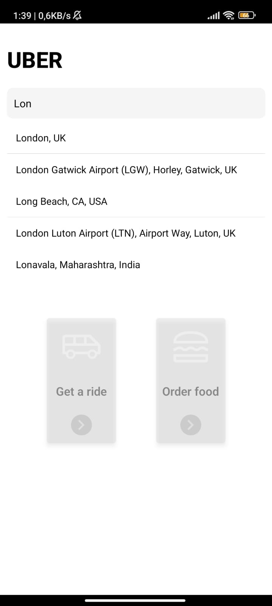

# Uber-Clone

## Project Overview

This project is an Uber-like mobile application developed using React Native. 
It aims to enhance the user experience by allowing users to choose locations, 
draw routes and calculate distances.

Some features of the project :
- User Login and Recording: Users can log in to the application or create a new account.
- Location Selection: Users can select their locations using Google Maps API.
- Favorite Places: Users can add their choice to favorites.
- Route Drawing: Imaging the route between the two points.
- Distance Calculation: Possibility of making distance calculations between users.
- Real-time map integration: show the user location on the map.
  
I used libraries,frameworks and APIs for some features in this project:
- expo-router for application router
- react-redux for state management
- Google Maps API: API used to display map and location data.
- Google Places API: API used to get location information.
- React Native Maps: Library used to integrate map components into the project

## Project Images

